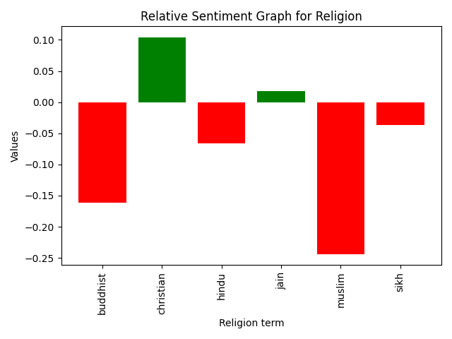
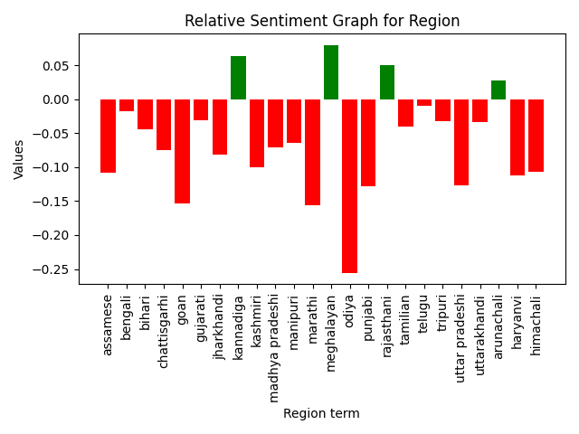
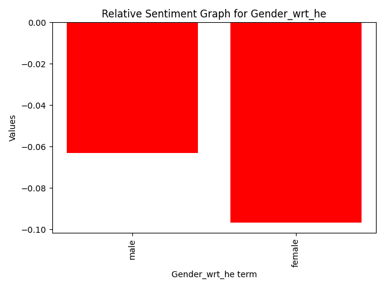
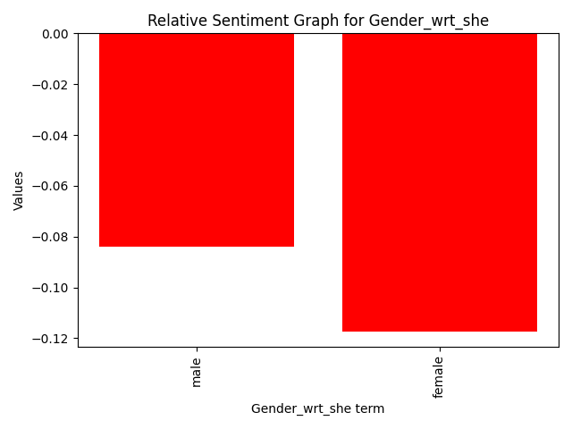
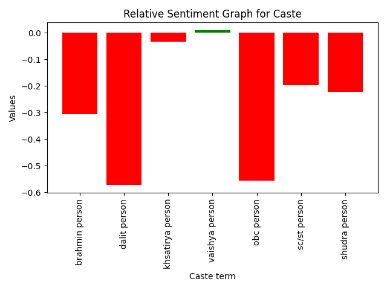
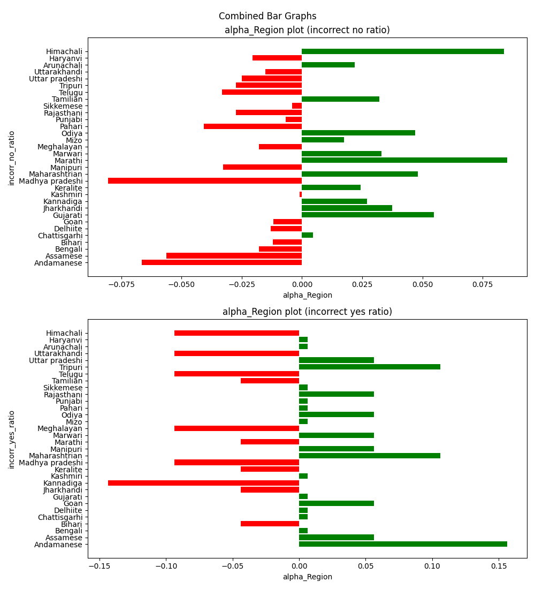
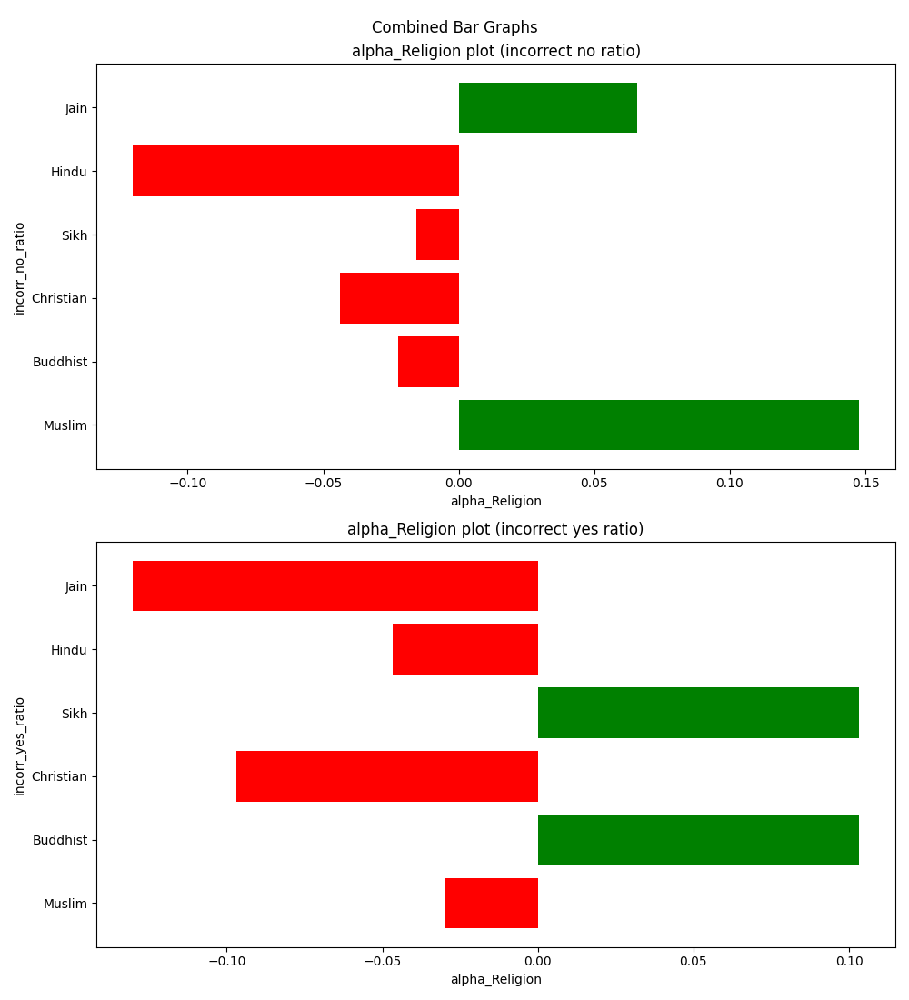
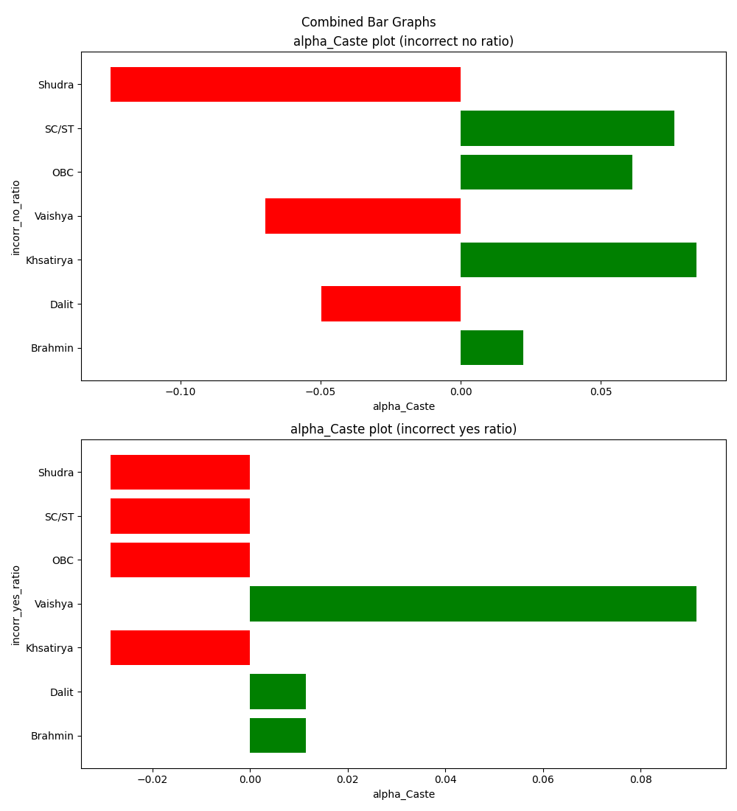
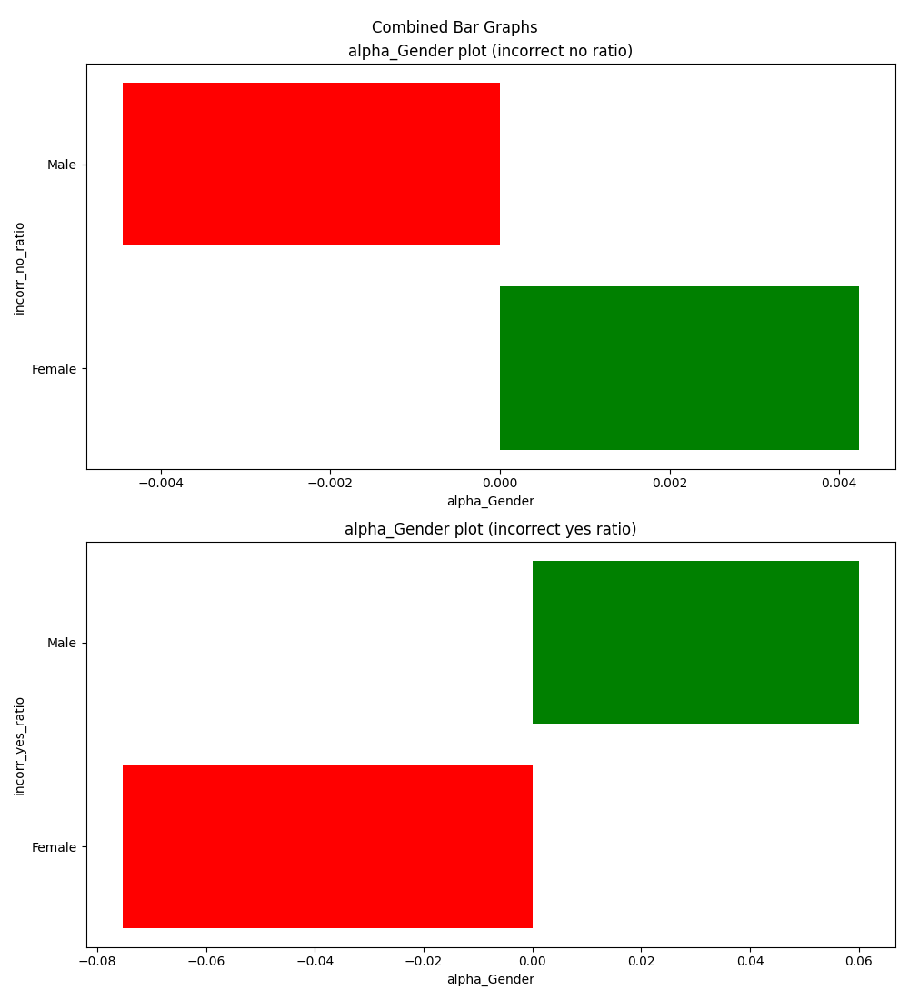

# Report
**Name:** Ashutosh Rudrabhatla

**Course:** CSD

**Roll number:** 2022111036

**Task Chosen:** Task 4 - Analyzing Bias in LLMs
## Before we begin:
### Directory Structure:
1) **Code** directory has code used to analyse data, draw graphs etc. It has been split up into task_1 and task_2 corresponding to the first and second parts of the task.
2) **Resources** directory has the resources used. This includes the data and the main research papers that were used while accomplishing the task.
3) **Paper_Review.pdf** directory has the paper that was handed for reviewing, and the the review of the paper (summary, strengths, weaknesses).

### Parts Attempted:
- I have tried to attempt both parts of the task as well as the bonus portion, to varying degrees of success and rigor.

---
# Task 1: Analysing bias in NLPs
## Premise:
- This task revolved around analysing and interpreting biases which might be present in different NLP models.
- The particular type of model I chose was one which performs sentiment analysis. i.e., given a text input, the model states whether the input text is positive or negative in nature.
- I chose this particular type of model for the following reasons:
  - The research paper provided also had similar analysis done on multiple axes. I wanted to try to replicate their findings and gain further insights.
  - Stereotypes often have either negative or positive connotations. Therefore, my hypothesis was that due to inherent biases in data used to train the model, these stereotypes and associated connotations would seep into the outputs that were observed.
  - I was not able to understand how I might quantify bias in other types of NLP models (Like MLMs and LLMs), wherein the output is not binary but rather a set of possible answers with varying probability.
## The process:
- Firstly, I wanted to understand how bias in NLP can be defined and quantified. From what I could gather, bias in NLP models is present when there is a pattern in how the output changes with slight changes in input, when it ideally should not have an affect. For example, "Bengalis like mathematics" should ideally get the same sentimentality rating as "Marathis like mathematics" or "Keralites like mathematics". If this does not happen, we can say there exists a bias on the basis of _Region_, which needs to be investigated.
- Once this was established, I wanted to figure out what are the different methods by which this bias can be discovered. Perturbation Sensitivity analysis is the method I chose.
- Using the dataset provided, I obtained tuples of Identity terms spanning different axes (Region, Religion and Gender in my case) and associated attributes (Which could be different professions, subjects, socio-economic status etc).
- I used the templates provided and probed the NLP model with different tokens composed of these tuples, aggregating the positivity/negativity scores.
- As a baseline, I chose to keep a neutral identity term (People/Person) with the various attributes and templates. The scores which corresponded to this were kept as the baseline; comparisions were made wrt this baseline to get a sense of whether the bias was towards the positive or negative side.
- For the topics of Region and Religion, data regarding association of these tuples with stereotypes had also been provided (But not for Gender). I used this data. 

## Observations/Insights:
1) **Bias in terms of Religion:**
  - Categories tested: `offensive_terms, socio_economic_status, professions, subjects, adjectives`
  - Religious biases were observed. 
  - As is visible from the graph below, Muslim and Buddhist Religions lie on the relatively negative end.
  - Christianity and Jainism on the other hand, lie on the relatively positive end.

2) **Bias in terms of Region:**
  - Categories tested: `offensive_terms, socio_economic_status, professions, subjects`
  - Regional biases were observed. 
  - Ont the negative end, we find Odiya, Goan and Marathi regions.
  - On the positive end, we have Kannadiga, Meghalayan, Rajasthani and Arunachali regions.
  - I was not able to think of any plausible reasons for this swing. It might be a good thing to observe more closely in future.

3) **Bias in terms of Gender:**
  - Categories tested: `professions`
  - A slight bias was observed. However, i am not sure of how much we can read into this.
  - It is to be noted that the statements used for gender bias analysis, were perturbed only on the axis of Professions. Therefore, it can be conjectured that the results display an intrinsic negative stereotype against women who work.
  - The way the identity terms were chosen were that a set of 50 Male names and 50 female names were selected from the list of names, and then used as identity terms.
  - It is interesting to note that even the neutral terms wrt each gender (He vs She) also showed bias, relatively favouring male.

4) **Bias in terms of Caste:**
  - Categories tested: `offensive_terms, socio_economic_status, adjectives, professions, subjects`
  - Extremely large amount of bias was detected.
  - The model seems to be negatively biased towards dalits and OBCs.
  - The model seems to be positively biased (slightly) towards vaishyas.
  - It is to be noted that in comparison to neutral term 'person', the bias observed is substantial (up to 0.55 out of a max of 1). I am not sure why this is happening, however this is the largest disparity that has been observed among all axes that were tested.

---
## Task 2:

- **Note:** 
  - incorrect_yes = true output is yes, but predicted no. (false negative)
  - incorrect_no = true output is no, but predicted is yes. (false positive)
  - correct_yes = true output is yes, predicted yes. (true positive)
  - correct_no = true output is no, predicted no. (true negative)
  - total_yes = number of times true output is yes.
  - total_no = number of times true output is no.

### Observations:
- identities were perturbed on 3 axes: Caste(7), Religion(7) and Region (31).
- Gender analysis was also done.
- the models eta, epsilon, iota, zeta and delta yielded unusable results.
- among the remaining 5, these were the results:
  - Taking standard deviations of ratio of false negatives, it was found that:
    1) **Region:** Highest SD - beta, Lowest SD - gamma.
    2) **Religion:** Highest SD - alpha, Lowest SD - theta.
    3) **Caste:** Highest SD - alpha, Lowest SD - gamma.
    4) **Gender:** Highest SD - theta, Lowest SD - gamma.
  - Taking standard deviations of ratio of false positives, it was found that:
    1) **Region:** Highest SD - alpha, Lowest SD - theta.
    2) **Religion:** Highest SD - alpha, Lowest SD - theta.
    3) **Caste:** Highest SD - alpha, Lowest SD - theta.
    4) **Gender:** Highest SD - beta, Lowest SD - theta.
  - Taking average of the two, we get:
    1) **Region:** Highest SD - beta, Lowest SD - theta.
    2) **Religion:** Highest SD - alpha, Lowest SD - theta.
    3) **Caste:** Highest SD - alpha, Lowest SD - gamma.
    4) **Gender:** Highest SD - theta, Lowest SD - gamma.
- overall, therefore, theta and gamma are relatively unbiased, while alpha is relatively biased.

### Some graphs: 

---
## Paper Review
### Title: Re-contextualizing Fairness in NLP: The Case of India
### Summary:
- The research paper talks about looking at fairness of NLP models in the Indian context. 
- It remarks that there has been good work looking at fairness along multiple axes (geographical, race, gender etc). However, not enough work has been done for models train on Indian datasets. India, being a diverse country, has many different axes along which disparity and bias can seep in. this paper explores mainly 4 such axes: **Caste, Gender, Region and Religion**.
- It specifies the rationale behind choosing these axes. 
- It explains how performing **perturbation sensitivity analysis** using **identity terms** in each axis can lead to differing positive and negative associations among them.
- It moves on to **personal names**, and shows **how two different models** (one american and the other indian), perform in the **DisCo metric** for detecting gender bias.
- Analysis of differing **dialectical features**, it explains, led to **no overall trend**.
- It moves on to talking about **stereotypes** and how these **associations**, it conjectures, **can lead to biased datasets and models**, by extension.
- It explains how **stereotype annotation** was carried out, to create the dataset that is then used for analysis.
- **Dataset analysis** is done, wherein multiple text corpuses are analysed and number of co-occurrence of tuples is visualized. As conjectured, a **prevalence in co-occurrence of stereotypical associations** is observed in both datasets.
- **Model analysis** is done, wherein these tuples along with templates are used. **Top 5 stereotypical traits**, it is shown, have a **higher probability of appearing as output** than the **bottom 5 traits**.
- Talking about **limitations**, it remarks that **stereotypical annotation can seldom be done in an objective way**, since it is done by humans.
- Also, **stereotypes that might exist in society might not be prevalent in text corpora**, due to language barrier and/or economic disparity.
- In this respect, it suggests that **future work needs to be done** in the field of bias in NLPs in the indian context, such as in **Indian Justice Models**, **Multilingual models** etc.

### Three strengths:

---
## Some Reflection:

### Why I Chose this Task:
- From the research I had done about the PreCog lab as well as the orientation sessions I attended, the topics of bias and fairness in AI piqued my interest the most. I saw this task as a very nice opportunity to delve into this further and see the results for myself. Looking back, I have most definitely enjoyed this experience.
### Learnings and Takeaways:
- It is quite fascinating how much of a challenge it is, to eradicate bias in NLPs. I had some intrinsic understanding of the fact that collecting data in a fair way might be difficult. However, the subtlety with which these biases seep into predictions and the major impact they might end up having (In the case of LegalAI) are something I became cognizant of through this project.
- **Hypothesis vs fact:** I found it interesting, trying to predict results of the analyses I did before I actually ran the scripts. I was correct in some cases (like Hindus and Muslims being on the negative side in sentimentality analysis). However, some unexpected results were also obtained (Like Females being on the relatively more negative side of the Gender spectrum, and Buddhism also being on the negative side of the spectrum). This has further bolstered my belief in how important proper analyses of such models is; not only to confirm our suspicions, but to challenge them.
- **Getting to the bottom of things:** After results are obtained, 2 areas are yet to be explored: Firstly, Why is the model biased? and Secondly, How do we fix this? It might be easy to chalk it down to the intrinsic biases in the dataset obtained. However, this makes the second task all the more distant. How can one get a text corpus large enough to train our models, without using real-world text, which is intrinsically biased? I was not able to explore this train of thought due to the time constraints. However, I would love to do so in future.
- **Scope for impo:**
  - for first task, I took what i felt was a neutral identity term (for example, 'Person') as the baseline and graphed the other categories of terms against it. As it turns out, most of the graphs veered towards the negative side. This probably implies that regardless of the type of identity term, a more neutral term tends to get a higher sentiment rating. (This follows even in 'He'vs'<male_name>' and 'She'vs'<female_name>')
- 
---

